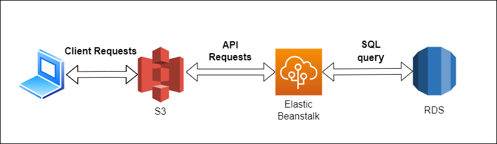

# Udagram Infrastructure Docs

## AWS RDS
This project uses an AWS RDS Postgres database.

## AWS S3
This project uses an AWS S3 bucket to store assets and to serve the website frontend.
URL: http://random-udagram-bucket.s3-website-us-east-1.amazonaws.com

## Elastic Beanstalk
This project uses an AWS Elastic Beanstalk environment to host the website.
URL: http://udagram-api-dev.eba-xjtzcasx.us-east-1.elasticbeanstalk.com
