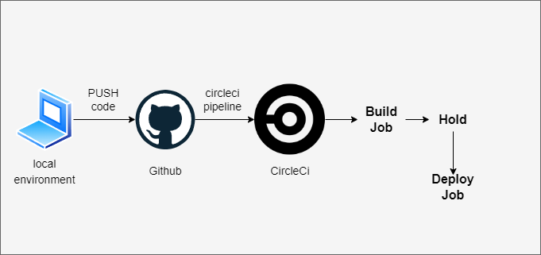

# Udagram Pipline Docs

### Github
Whenever you `push` code to Github, it will automatically deploy the code to AWS and update the website.

### CircleCI
CircleCI is a continuous integration service that runs on Github.

It follows the steps set in the `.circleci/config.yml` file.

- `build`: Builds the code.
- `deploy`: Deploys the code to AWS.

> **Note**: When the pipeline is triggered after the build is successful, you will need to manually trigger the deploy step in CircleCI.